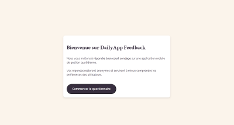
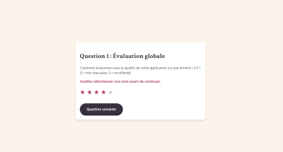
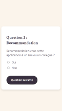
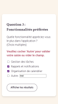
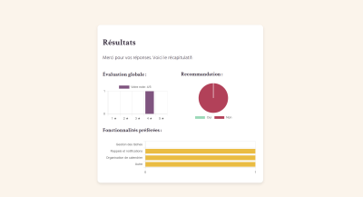
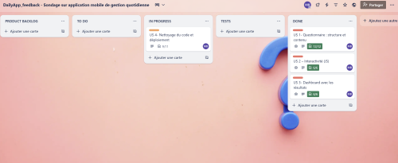
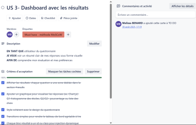

#  DailyApp Feedback
**DailyApp Feedback** est une application web interactive qui permet de recueillir facilement les retours des utilisateurs de DailyApp, application mobile destinée à faciliter l’organisation quotidienne et le suivi des habitudes.


Elle propose un **questionnaire en trois étapes** (note, recommandation, fonctionnalités préférées) et présente les **résultats** sous forme de graphiques dynamiques et visuels (histogrammes et camembert).

**Ce projet met en avant** :
- Une navigation fluide et progressive (question par question).
- Une expérience utilisateur soignée (design responsive et animations).
- Des visualisations de données claires grâce à Chart.js.

**L’objectif** est de fournir un outil simple, efficace et moderne pour analyser la satisfaction des utilisateurs et leurs attentes.

## Tester le sondage en ligne 

- Cliquer sur le lien suivant pour réaliser le sondage : [DailyApp Feedback](https://dailyappfeedback.netlify.app/)

## Aperçus 

<div style="display:flex; gap: 5px; margin: 5px 5px;">
    
    
</div>

<div style="display:flex; gap: 5px; margin: 5px 5px;">
    
    
    
</div>

## Fonctionnalités

1. **Questionnaire multi-étapes** avec navigation fluide
2. **Validation** des formulaires avec messages d'erreur
3. **Visualisation des résultats** avec graphiques interactifs (Chart.js)
4. **Design responsive** adapté pour mobile et desktop
5. **Interface moderne** avec animations CSS

## Questions du questionnaire

1. **Q1 Évaluation globale**: note de 1 à 5 étoiles
2. **Q2 Recommandation**: question Oui/Non
3. **Q3 Fonctionnalités préférées**: sélection multiple avec option "Autre" (champ texte)

## Technologies utilisées

- **HTML5**: structure sémantique
- **CSS3**: design responsive avec Flexbox/Grid
- **JavaScript ES6**: logique interactive
- **Chart.js**: Graphiques (histogrammes/camembert) 
- **Google Fonts**: typographie (Crimson Text + Hind Madurai)

## Structure du projet

```
dailyapp-feedback/
├── index.html          # Page principale
├── style.css           # Styles et responsive design
├── script.js           # Logique du questionnaire
└── README.md           # Documentation
```

## Installation et utilisation

1. Cloner le repository : `git clone https://github.com/Melissa-code/dailyapp_feedback.git`
2. Aller dans le dossier du projet : `cd dailyapp_feedback`
3. Ouvrir un navigateur et aller sur l'URL en local (via VSCode Live Server par exemple): `http://127.0.0.1:5500/dailyapp_feedback/`


## Déploiement

- Le projet est déployé avec **Netlify**

- Workflow pour déployer à nouveau :
    - Vérifier que les derniers changements sont bien sur main
    - Choisir la branche main comme source

## Workflow Git et GitHub

- Utilisation du workflow Git standard avec **branches par User Story**

**Conventions de commits** :
- **feat**: ajout d’une fonctionnalité
- **fix**: correction d’un bug
- **doc**: documentation 
- **chore**: tâches annexes (nettoyage console.log)
- **Pull Requests (PR)**: chaque US fait l’objet d’une PR avec un titre et une description claire
- **Merge** vers main après validation

## Gestion de projet (Kanban)

Suivi de l’avancement via un tableau Kanban :

- **Backlog** avec toutes les US 
- **To Do** : user stories à réaliser
- **In Progress** : tâches en cours
- **Tests/Review** : code en attente de validation (PR)
- **Done** : fonctionnalités terminées et mergées




## Fonctionnalités techniques

- **Navigation par étapes** avec validation avant progression
- **Gestion d'erreurs** avec messages contextuels
- **Collecte de données** dans un objet JavaScript structuré
- **Graphiques dynamiques** générés selon les réponses utilisateur

## Types de graphiques

- **Q1 Histogramme vertical**  (évaluation par étoiles)
- **Q2 Graphique en camembert** (recommandation Oui/Non)
- **Q3 Histogramme horizontal** (fonctionnalités sélectionnées)

## Améliorations

- **Sauvegarde** des résultats en base de données
- **Export** des résultats en PDF
- **Système de notifications** par email
- **Analyse comparative** des résultats

## Contribuer

Les contributions sont les bienvenues 
1. Forker le projet  
2. Créer une branche (`git checkout -b feature/ma-fonctionnalite`)  
3. Commit (`git commit -m "feat: ajoute une nouvelle fonctionnalité"`)  
4. Push (`git push origin feature/ma-fonctionnalite`)  
5. Ouvrir une Pull Request 

## Auteur

- Melissa-code 

## Licence

- Ce projet est sous licence MIT